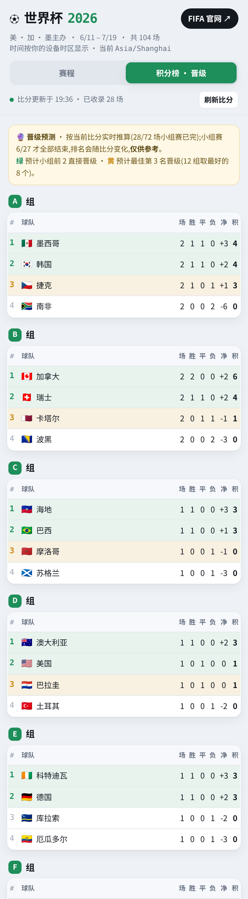

# 世界杯2026 ⚽ 赛程提醒系统


## 🎯 项目简介

一个 **2026 美加墨世界杯** 的赛程提醒系统:一个**网页**(实时比分 + 完整赛程 + 积分榜/晋级预测 + 直播入口,按你设备所在时区显示)+ 一个**可订阅的 Apple 日历**(自动推送每场的「赛前 15 分钟 / 开球 / 赛果」提醒)。

让球迷**一场都不错过**,并随手看到比分、赛程、各组排名与晋级形势。整套系统**零成本、零运维**,且会随赛事进程**自动更新**——小组赛结束后自动填入并切换到淘汰赛,无需人工。

## 📸 项目截图

| 赛程 + 实时比分(按轮次切换) | 积分榜 · 晋级 32 强预测 |
| :---: | :---: |
|  |  |

## ✨ 功能介绍

**已完成功能**

- 全 **104 场**赛程,按**设备时区**显示开球时间;进页面自动定位到「已结束 ↔ 未开始」交界,当天动态一眼可见
- **赛程按轮次切换**:全部 / 小组赛 / 32强 / 16强 / 8强 / 4强 / 决赛;**进页面自动选中当前进行中的轮次**,往轮可随时切回查看
- **实时比分**(浏览器直连 ESPN 公开接口),胜/平角标、进行中滚动动画
- **比分兜底**:云端定时把比分快照到 `live/scores.json`,浏览器直连 ESPN 失败时(如部分地区网络)**自动回退读同源快照**,比分不再空白
- **积分榜 + 晋级 32 强预测**:按 **FIFA 规则**(积分 → 净胜球 → 进球 → 相互战绩)实时排各组名次,推算 12 个小组前 2 + 8 个最佳第 3 名
- **淘汰赛对阵图 / 晋级**:32强 → 16强 → 8强 → 半决赛 → 决赛逐轮展示,按结果标记晋级方,直至 🏆 冠军(点球决出的比赛也判得准)
- **淘汰赛对阵自动回填**:小组赛结束后,定时任务从 ESPN 抓取真实对阵写回数据源,**零人工**,逐轮自动填满
- **可订阅 Apple 日历**:每场两条日程(比赛 + 赛果)、三道提醒(赛前 15 分钟 / 开球 / 赛果)
- **直播入口**:顶部常驻 + 点「进行中」卡片弹窗,三选一(央视频 / 咪咕 / 小红书)
- **自动化测试 + CI**:积分榜、淘汰赛回填、比分快照均有单测,构建前自动跑;改数据源即自动重建并发布

**计划功能**

- 可选:并装 Umami 看独立访客数
- 决赛后将「赛事提醒 + 时区 + 自动发布」沉淀为可复用的通用赛事模板

## 🧱 技术栈

- **Frontend：** 原生 HTML / CSS / JavaScript(单文件、无框架、无打包工具);浏览器原生 `Intl` API 做时区渲染;`fetch` 调外部接口
- **Backend：** 无(纯静态)
- **Database：** 无(赛程存于 `data/matches.json`;比分来自 ESPN 接口,并由 CI 快照到 `live/scores.json` 兜底)
- **Cloud：** GitHub Pages(静态托管)、GitHub Actions(构建 / 淘汰赛回填 / 比分快照三条工作流)
- **测试：** Node(`test_standings.js`)+ Python 标准库(`test_update_knockout.py`、`test_fetch_scores.py`),CI 构建前自动运行
- **其他：** ESPN 公开接口(实时比分与淘汰赛对阵)、Cloudflare Web Analytics、iCalendar `.ics`(Python 标准库手写生成)

## 🗂️ 项目结构

```text
worldcup-2026-reminder/
├── README.md                      # 项目说明(本文件)
├── index.html / worldcup.ics      # 构建产物:可部署网页 / 可订阅日历
├── data/
│   └── matches.json               # ★ 单一数据源(104 场)
├── live/
│   └── scores.json                # 比分快照(CI 定时写,前端兜底读)
├── src/
│   └── template.html              # 网页模板(__DATA__ / __FIFA__ 占位)
├── scripts/
│   ├── build_site.py / build_calendar.py / build_all.py   # 构建
│   ├── update_knockout.py         # 从 ESPN 自动回填淘汰赛对阵
│   ├── fetch_scores.py            # 抓 ESPN 比分 → live/scores.json
│   └── test_*.py / test_standings.js                      # 单元测试
└── .github/workflows/
    ├── build.yml                  # 改数据 → 跑测试 → 重建发布
    ├── update.yml                 # 定时回填淘汰赛对阵(零人工)
    └── scores.yml                 # 定时快照比分(兜底)
```

## 🔗 在线体验

- 项目地址：<https://wc2026worldcup.github.io/worldcup/>
- 日历订阅：`https://wc2026worldcup.github.io/worldcup/worldcup.ics`
- GitHub 地址：<https://github.com/wc2026WorldCup/worldcup>

## 📈 当前进度

- 完成度:约 **92%**
- 当前阶段:**已上线**(GitHub Pages 运行中);小组赛进行中,淘汰赛对阵将随赛事自动填充

## 🗺️ Roadmap

- [x] 积分榜 + 晋级 32 强预测(FIFA 规则)
- [x] 淘汰赛对阵图 / 晋级(含点球胜者判定)
- [x] 赛程按轮次切换 + 自动定位当前轮
- [x] CI 从 ESPN 自动回填淘汰赛对阵(零人工)
- [x] 比分接口容错层(同源缓存兜底)
- [x] 自动化测试接入 CI
- [ ] 可选:并装 Umami 看独立访客数
- [ ] 决赛后沉淀为通用「赛事提醒」模板

## 💡 学习收获

- 用「纯静态 + 第三方接口 + 免费托管」把一个真实需求**零成本零运维**地做上线
- 用浏览器 `Intl` API 做**时区自适应**,免后端
- 手写 iCalendar(`.ics`):事件 / 提醒 / 订阅刷新机制,以及按字节折行兼容中文与 emoji
- 用 **GitHub Actions** 把「源文件 → 成品」做成自动构建,并扩展出**定时自动回填对阵**与**比分快照兜底**两条流水线
- 第三方接口不可控时的**优雅降级**:云端快照 + 同源回退,解决直连失败(如部分地区无法访问 ESPN)
- 把 FIFA 小组出线与淘汰赛规则**代码化**,并用单测守住正确性

## 🛠️ 本地构建与测试

```bash
python scripts/build_all.py        # 生成 index.html 与 worldcup.ics
node   scripts/test_standings.js   # 积分榜 / 晋级 / 点球判定单测
python scripts/test_update_knockout.py
python scripts/test_fetch_scores.py
```

仅需 Python 3 标准库与 Node(测试用),无第三方运行时依赖。
