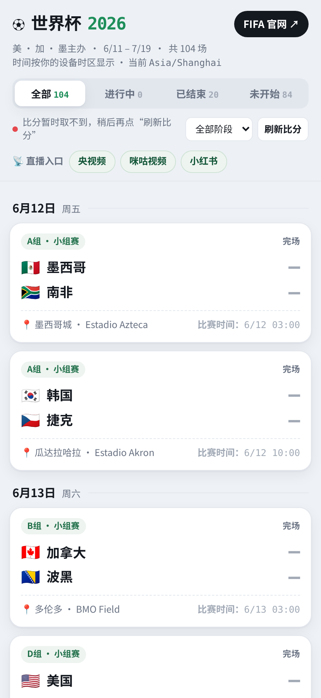

# 世界杯2026 ⚽ 赛程提醒系统


## 🎯 项目简介

一个 **2026 美加墨世界杯** 的赛程提醒系统:一个**网页**(实时比分 + 完整赛程 + 直播入口,按你设备所在时区显示)+ 一个**可订阅的 Apple 日历**(自动推送每场的「赛前 15 分钟 / 开球 / 赛果」提醒)。让球迷不错过任何一场,并随手看到比分、赛程与直播入口。

## 📸 项目截图



## ✨ 功能介绍

**已完成功能**
- 全 **104 场**赛程,按**设备时区**显示开球时间;按 `进行中 / 已结束 / 未开始` + `小组赛 / 淘汰赛` 双层筛选,首屏自动滚到下一场
- **实时比分**(浏览器直连 ESPN 公开接口),胜/平角标、进行中滚动动画
- **可订阅 Apple 日历**:每场两条日程(比赛 + 赛果)、三道提醒(赛前 15 分钟 / 开球 / 赛果)
- **直播入口**:顶部常驻 + 点「进行中」卡片弹窗,三选一(央视频 / 咪咕 / 小红书)
- **访问统计**(Cloudflare Web Analytics);日历链接带 `?from=cal` 标记来源
- **GitHub Actions CI**:改数据源即自动重建并发布

**开发中功能**
- 暂无(当前核心功能均已上线)

**计划功能**
- 6/27 小组赛结束后填入淘汰赛真实对阵
- 让 CI 从接口自动抓取淘汰赛队名(零人工)
- 可选:并装 Umami 看独立访客数

## 🧱 技术栈

- **Frontend：** 原生 HTML / CSS / JavaScript(单文件、无框架、无打包工具);浏览器原生 `Intl` API 做时区渲染;`fetch` 调外部接口
- **Backend：** 无(纯静态)
- **Database：** 无(赛程写死于 `data/matches.json`;比分来自外部接口)
- **Cloud：** GitHub Pages(静态托管)、GitHub Actions(CI 自动构建)
- **AI：** 兜底比分源用 Anthropic API + 联网搜索(仅 Claude Artifact 预览环境生效,线上不启用)
- **其他：** ESPN 公开接口(实时比分)、Cloudflare Web Analytics(统计)、iCalendar `.ics`(Python 标准库手写生成)

## 🗂️ 项目结构

```text
worldcup-2026-reminder/
├── README.md                   # 项目说明(本文件)
├── index.html                  # 构建产物:可部署网页
├── worldcup.ics                # 构建产物:可订阅日历
├── data/
│   └── matches.json            # ★ 单一数据源(104 场)
├── src/
│   └── template.html           # 网页模板(__DATA__ / __FIFA__ 占位)
├── scripts/
│   ├── build_site.py           # matches.json + 模板 → index.html
│   ├── build_calendar.py       # matches.json → worldcup.ics
│   └── build_all.py            # 一键构建
└── .github/workflows/build.yml # CI 自动构建
```

## 🔗 在线体验

- 项目地址：<https://wc2026worldcup.github.io/worldcup/>
- 日历订阅：`https://wc2026worldcup.github.io/worldcup/worldcup.ics`
- GitHub 地址：<https://github.com/wc2026WorldCup/worldcup>

## 📈 当前进度

- 完成度：约 **85%**
- 当前阶段：**已上线**(GitHub Pages 运行中,核心功能可用)

## 🗺️ Roadmap

- [ ] 6/27 后填入淘汰赛真实对阵(改 `data/matches.json`,CI 自动发布)
- [ ] 让 CI 从 ESPN 自动抓取淘汰赛对阵(零人工)
- [ ] 补充自动化测试 / 比分接口容错层
- [ ] 可选:并装 Umami 看独立访客数

## 💡 学习收获

- 用「纯静态 + 第三方接口 + 免费托管」把一个真实需求**零成本零运维**地做上线
- 用浏览器 `Intl` API 做**时区自适应**,免后端
- 摸清 iCalendar(`.ics`)的事件 / 提醒 / 订阅刷新机制,以及 **iOS 订阅日历提醒的坑**
- 用 **GitHub Actions** 把「源文件 → 成品」做成自动构建,把"手动上传两个文件"降为"改一个数据文件"

## 🛠️ 本地构建

```bash
python scripts/build_all.py        # 生成 index.html 与 worldcup.ics 到项目根目录
```

仅需 Python 3 标准库,无第三方运行时依赖(校验 `.ics` 时可选装 `icalendar`,仅开发用)。
